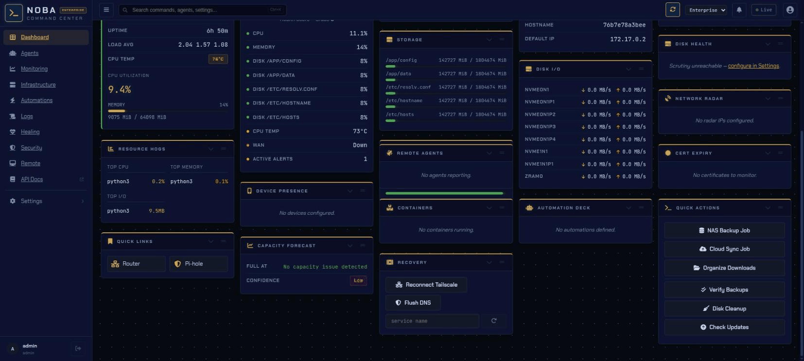
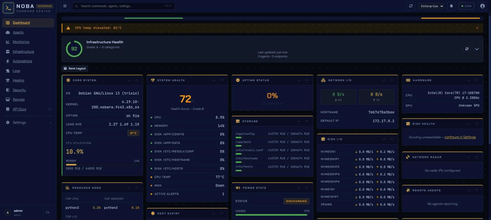
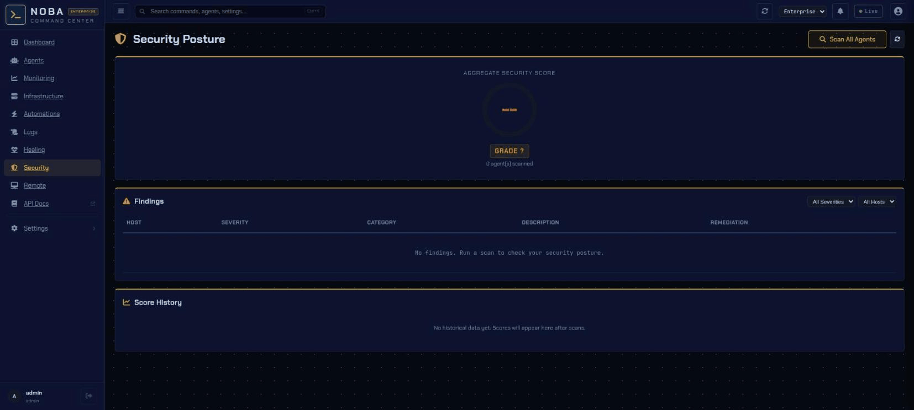
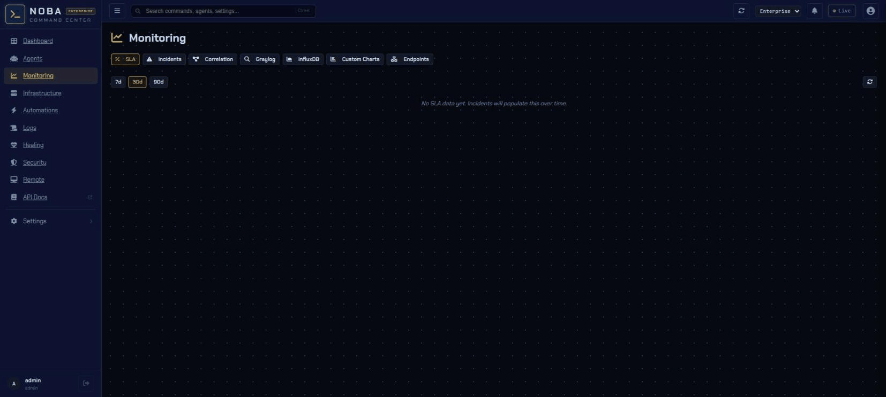
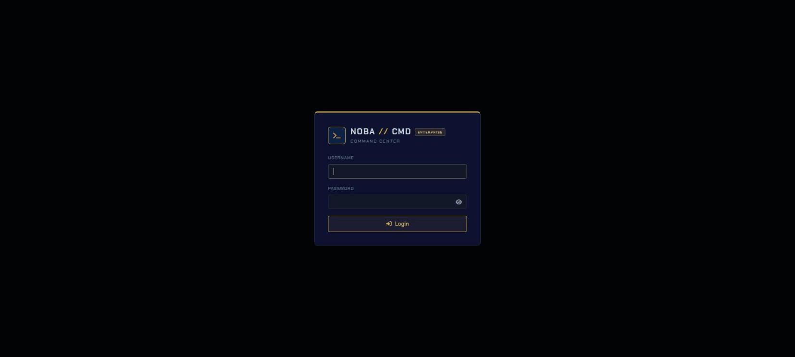

<div align="center">

# NOBA Command Center — Enterprise

**Infrastructure management, from one dashboard.**

Real-time monitoring · Self-healing infrastructure · Remote agents · Predictive intelligence · 40+ integrations
Deploy anywhere — bare metal, Docker, multi-site.

`FastAPI` · `Vue 3 + Vite` · `Chart.js` · `SQLite / PostgreSQL / MySQL` · `Pinia`

<br>



</div>

---

## ⚡ Quick Start

### 🐧 Bare Metal

```bash
git clone https://github.com/raizenica/noba-enterprise.git
cd noba-enterprise
bash install.sh
```

Grab your generated admin password:
```bash
journalctl --user -u noba-web.service | grep password
```

### 🐳 Docker

```bash
git clone https://github.com/raizenica/noba-enterprise.git
cd noba-enterprise
docker compose up -d
```

```bash
docker logs noba 2>&1 | grep password
```

Open `http://localhost:8080` and you're in. 🎉

<details>
<summary>📦 Docker volumes & options</summary>

| Mount | Purpose |
|-------|---------|
| `./data/config:/app/config` | Settings, users, agent keys (persists across restarts) |
| `./data/db:/app/data` | SQLite database (metrics, history, agent registry) |
| `/var/run/docker.sock:/var/run/docker.sock:ro` | Container monitoring (optional) |

**Custom port or timezone:**
```yaml
ports:
  - "9090:8080"
environment:
  - TZ=America/New_York
```

**Podman?** Mount the Podman socket instead:
```yaml
volumes:
  - /run/user/1000/podman/podman.sock:/var/run/docker.sock:ro
```

</details>

---

## 🏢 Enterprise Features

Everything in the community edition, plus:

| Feature | Description |
|---------|-------------|
| **SAML 2.0 SSO** | IdP-initiated and SP-initiated login, metadata endpoint, attribute mapping |
| **SCIM 2.0 Provisioning** | Auto-provision / deprovision users and groups from your identity provider |
| **WebAuthn / Passkeys** | Hardware key and biometric login — FIDO2 compliant |
| **PostgreSQL backend** | Drop-in replacement for SQLite — connection pooling, HA-ready |
| **MySQL / MariaDB backend** | Alternative relational backend for existing DB infrastructure |
| **Enterprise theme** | Deep navy + gold UI palette, ENTERPRISE badge throughout |
| **Multi-instance management** | Manage and monitor instances across sites from a single pane |

See [docs/enterprise-setup.md](docs/enterprise-setup.md) for full setup instructions.

---

## 🖥️ Features at a Glance

### 📊 Dashboard & Monitoring

Live system metrics, sparkline charts, health bar, anomaly detection — updated every 5 seconds via SSE.



- 🔥 **CPU, RAM, disk, network, temps, ZFS, containers** — all at a glance
- 📈 **Time-series charts** with zoom/pan and multi-metric correlation
- 🟢 **Health bar** — color-coded pips for instant infrastructure overview
- 🔍 **Anomaly detection** — automatic Z-score flagging of unusual patterns
- 📱 **Mobile responsive** — bottom nav + slide-over sidebar on small screens

### 🤖 Remote Agents

Deploy lightweight agents to any Linux (or Windows) box. Send 42 command types in real time.

- 🚀 **Zero-dependency agent** — reads `/proc` directly, optional psutil for cross-platform
- ⚡ **WebSocket real-time** — instant command delivery with HTTP polling fallback
- 📡 **Streaming output** — long-running commands stream line-by-line
- 📁 **File transfer** — push/pull up to 50 MB with SHA256 verification
- 🖥️ **Remote desktop** — live screen view + mouse/keyboard/clipboard control (Wayland/X11/Windows/macOS)
- 💻 **Embedded terminal** — full PTY session via WebSocket, streamed to browser xterm.js
- 🛡️ **Risk-tiered auth** — low (viewer) / medium (operator) / high (admin-only)
- 🔄 **Self-update** — agents pull updates from the NOBA server and restart
- 🖱️ **One-click deploy** — from the dashboard via SSH, or copy-paste a one-liner

### 🛡️ Security Posture

Per-agent security scoring with findings, config audit, and posture ring.



- 🔐 **SAML 2.0 / OIDC / LDAP** — enterprise identity providers, attribute mapping
- 🔑 **WebAuthn / Passkeys** — FIDO2 hardware keys and biometrics
- 🔏 **SCIM 2.0** — automatic user lifecycle management from your IdP
- 👥 **3-tier RBAC** — admin, operator, viewer with fine-grained permissions
- 📋 **Audit logging** — every action tracked with username, IP, timestamp
- 🚦 **Rate limiting** — per-IP and per-user with automatic lockout

### 📡 Monitoring & SLA

SLA dashboards, incident tracking, endpoint checks, custom charts, InfluxDB panels.



- 📊 **SLA dashboard** — 7d/30d/90d uptime percentages per agent/service
- 🚨 **Composite alert rules** — AND/OR conditions with escalation policies
- 🩹 **Self-healing pipeline** — 6-layer architecture: correlation, dependency analysis, planning, execution, verification, learning
- 🔔 **Notifications** — Pushover, Gotify, Slack, email, voice, browser push (PWA)
- 🕐 **Maintenance windows** — suppress or queue healing during planned downtime

### 🏗️ Infrastructure & Ops

Service topology, config drift detection, network maps, predictive disk intelligence.

- 🗺️ **Service dependency topology** — force-directed graph with impact analysis
- 🔀 **Configuration drift** — baseline checksums across agents, alert on changes
- 🌐 **Tailscale network map** — visual node grid with online/offline status
- 💾 **Predictive capacity planning** — multi-metric regression with seasonal decomposition and 68%/95% confidence intervals
- 🏥 **Per-service health scoring** — weighted composite (uptime 40%, latency 25%, error rate 20%, headroom 15%)
- 📝 **Real-time log streaming** — live tail via WebSocket, color-coded by priority
- 📄 **Public status page** — component groups, 90-day uptime, no auth required

### 🔑 Login

Enterprise-grade login with SSO support out of the box.



- **SAML 2.0 button** — auto-detected when SAML is configured
- **OIDC / OAuth providers** — Google, GitHub, Microsoft, and custom
- **Standard credentials** — username + password with TOTP 2FA option

---

## 🔌 40+ Integrations

| Category | Services |
|:---------|:---------|
| 🎬 **Media** | Plex, Jellyfin, Tautulli, Overseerr, Radarr, Sonarr, Lidarr, Readarr, Bazarr, Prowlarr, qBittorrent |
| 🖥️ **Infrastructure** | TrueNAS, Proxmox VE, Scrutiny (SMART), Frigate (NVR), InfluxDB, Uptime Kuma |
| 🌐 **Network** | Pi-hole v5/v6, AdGuard Home, Traefik, Nginx Proxy Manager, Cloudflare, UniFi |
| 🏠 **IoT & Home** | Home Assistant, Homebridge, Zigbee2MQTT, ESPHome, UniFi Protect, PiKVM |
| 🛠️ **DevOps** | Kubernetes, Gitea, GitLab, GitHub, Paperless-ngx, Vaultwarden |
| 🔑 **Auth** | SAML 2.0, SCIM 2.0, WebAuthn, OIDC/OAuth, LDAP/AD, TOTP 2FA, API keys |
| 📡 **Monitoring** | Tailscale mesh, cert expiry, domain expiry, weather, energy (Shelly) |

---

## 🤖 AI Ops Assistant

> *Completely optional — everything works without an LLM configured.*

- 🧠 **Multi-provider** — Anthropic (Claude), OpenAI, Ollama (local), or any OpenAI-compatible endpoint
- 💬 **Infrastructure-aware chat** — live agent status, alerts, and metrics in the system prompt
- 🔎 **Alert & log analysis** — "Explain this alert" with suggested remediation
- 🎯 **Action buttons** — AI suggests agent commands rendered as one-click buttons
- 📝 **Incident summarization** — auto-generate post-mortem reports

---

## ⚙️ Automation Engine

- 🔧 **10 automation types** — script, webhook, service, workflow, condition, delay, notify, HTTP, agent_command, remediation
- 🔀 **Visual workflow builder** — drag-and-drop nodes with conditional branching, approval gates, parallel splits, and delay nodes
- ⏰ **Triggers** — cron, file system changes, RSS feeds, webhooks (HMAC validated), HA events
- ✅ **Approval gates** — queue actions for manual approval with auto-approve timeout
- 🛡️ **Per-rule autonomy** — execute / approve / notify / disabled per alert rule
- 🔧 **55 remediation actions** — cross-platform with capability-based dispatch (Linux, Windows, Alpine, macOS)
- 🕐 **Maintenance windows** — named schedules with alert suppression and autonomy override
- 📋 **Action audit trail** — full context for every automated action (trigger, outcome, approval, duration)
- 📖 **Playbook templates** — 4 pre-built maintenance playbooks, customizable

### 🏥 Self-Healing Pipeline

Fully autonomous infrastructure repair with safety controls and graduated trust.

- 🔄 **55 heal actions** — restart, reload, kill, cleanup, renew, scrub, patch, reboot, migrate — with fallback chains for cross-platform dispatch
- 🧠 **Dependency graph** — root cause analysis suppresses downstream noise (NAS down? don't restart Plex 50 times)
- 🌐 **Site isolation** — ISP outage at one site doesn't trigger false restarts at that site
- 🛡️ **Tiered approvals** — low-risk auto-heals, medium notifies, high-risk requires human approval with escalation chains
- 📊 **Effectiveness tracking** — success rates, MTTR, per-rule analytics in a dedicated healing dashboard
- 🔮 **Predictive healing** — capacity forecasts and anomaly detection trigger proactive cleanup before thresholds breach
- 📸 **State snapshots + rollback** — captures pre-heal state, auto-rollback for reversible actions that fail verification
- 🔬 **Chaos testing** — 12 built-in scenarios for controlled fault injection (dry-run or live)
- 🐣 **Canary rollout** — new rules progress: observation → dry-run → notify → approve → execute
- 🏗️ **139 integration operations** — abstract heal ops across 29 categories (NAS, hypervisor, media, DNS, and 25 more)
- 🔌 **Multi-instance** — 3 TrueNAS boxes, quad Pi-hole, 2 Proxmox nodes — each with independent config and health tracking
- 📱 **Setup wizard** — 4-step guided flow to add any integration (pick category → platform → configure → test → save)
- 🤖 **Agent autonomy** — agents probe 22+ tools, heal locally when server is unreachable, report back on reconnect
- ⚡ **11 default escalation chains** — CPU, disk, memory, service, container, DNS, VPN, backup — work out of the box

---

## 🎨 UI / UX

- 🧭 **Sidebar navigation** — persistent left sidebar with ENTERPRISE badge, icon-only collapse
- 🔍 **Global search** — `Ctrl+K` command palette
- 🎭 **8 themes** — Enterprise, Default, Nord, Dracula, Tokyo, Catppuccin, Gruvbox, Blood Moon
- 👁️ **Quick glance** — press `g` to collapse all cards to headers
- ⌨️ **Keyboard shortcuts** — fully customizable hotkeys
- 🔔 **Notification center** — bell icon with unread count + PWA push
- 💻 **Embedded terminal** — WebSocket PTY via xterm.js (admin-only)
- 🔄 **Self-update** — check for updates and apply them from the UI (Settings → General)
- 📚 **API docs** — Swagger UI at `/api/docs`, ReDoc at `/api/redoc` (enable with `NOBA_DEV=1`)

---

## 🚀 Deploy Agents

From the dashboard: **Agents → Deploy Agent** (SSH or install script)

**Linux (any distro):**
```bash
curl -sf "http://noba-server:8080/api/agent/install-script?key=YOUR_KEY" | sudo bash
```

**Windows (PowerShell):**
```powershell
.\install-agent.ps1 -Server "http://noba-server:8080" -Key "YOUR_KEY"
```

---

## 🗂️ Project Layout

```
share/noba-web/server/       → Python backend (FastAPI, 19 routers, 300+ API routes)
share/noba-web/server/db/    → SQLite layer split into 23 domain modules (metrics, healing, audit…)
share/noba-web/frontend/src/ → Vue 3 frontend (140+ components, 12 views, Pinia stores)
share/noba-web/static/dist/  → Built Vue app (committed, no Node.js needed at runtime)
share/noba-agent/            → Agent zipapp source (9 modules: __main__, commands, rdp, terminal…)
libexec/                     → Shell scripts (backup, disk check, cloud sync)
dev/                         → Developer toolkit (7 tools)
tests/                       → pytest test suite (3181 tests)
```

## 🧪 Developer Toolkit

```bash
dev/eye.py               # 👁️  Playwright UI screenshot tool
dev/harness.sh           # 🔧 Dev server lifecycle manager
dev/e2e.py               # 🧪 10 browser E2E tests
dev/smoke.py             # 💨 API smoke tester (160+ routes)
dev/crossref.py          # 🔗 Multi-file cross-reference validator
dev/trace.py             # 🔬 Request trace middleware + analyzer
dev/recon.py             # 📡 Tailscale infrastructure scanner
```

## 🔧 Configuration

```
~/.config/noba/config.yaml
```

All settings are also configurable from the dashboard UI under **Settings → Integrations** (organized into 7 categories).

## 🌍 Environment Variables

| Variable | Default | Description |
|----------|---------|-------------|
| `PORT` | `8080` | HTTP listen port |
| `SSL_CERT` | — | Path to TLS certificate |
| `SSL_KEY` | — | Path to TLS private key |
| `NOBA_REDIS_URL` | — | Optional Redis for caching |
| `NOBA_CELERY_BROKER` | — | Optional Celery for job queue |
| `NOBA_TERMINAL_ENABLED` | `true` | Enable/disable web terminal |

---

<div align="center">

**Prerequisites:** Python 3.10+ · Linux (Fedora, Ubuntu, Debian, Raspberry Pi OS, TrueNAS SCALE)

📄 MIT License · [Community Edition](https://github.com/raizenica/noba)

</div>
